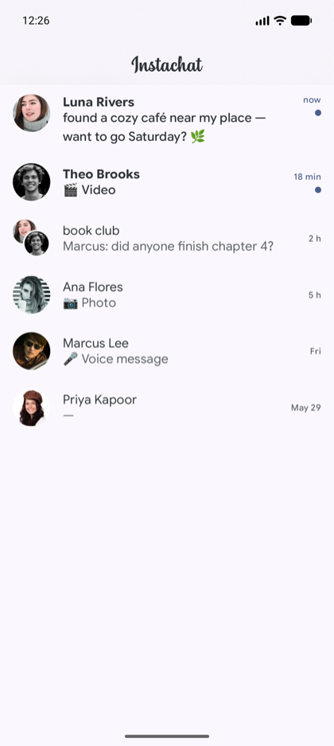
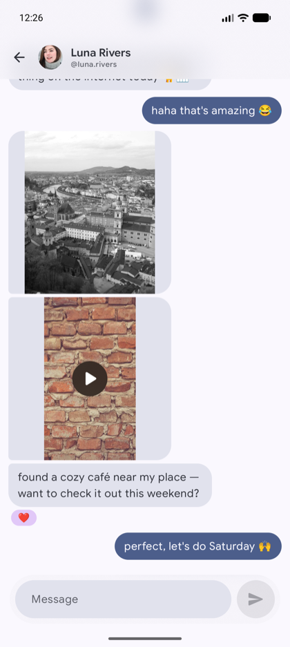

# Instachat

A native Android client for Instagram Direct — just the messages, none of the feed.

**The point is to cut screen time and stop doomscrolling while keeping the inbox.** Instagram's own app drops you into an endless feed, Reels, and Stories on every launch; the one thing I actually wanted to keep was talking to people. Instachat is a from-scratch DM-only client: inbox, conversations, sending messages, reactions, media, and read receipts — with no feed, no Reels, no explore, nothing to scroll.

It's also a personal playground for exploring a modern Android stack end to end — 100% Kotlin, Jetpack Compose, and Material 3 Expressive — with the UI built from scratch, independent of the official app.

The architectural trick is the data backend: rather than reimplementing the web client's auth from scratch, the app keeps a single long-lived WebView on the authenticated Instagram web session and runs each operation from inside the page itself, so the browser handles session state natively.

**Stack:** Kotlin · Jetpack Compose (Material 3 Expressive) · Hilt · Coroutines · KotlinX Serialization · Coil · Media3. Build with `./gradlew :app:assembleDebug`.

## Screenshots

<table>
  <tr>
    <td align="center"> Chats</td>
    <td align="center"> Conversation</td>
    <td align="center"> Media viewer</td>
  </tr>
</table>

Screenshots use mock data; avatars from <a href="https://pravatar.cc">pravatar.cc</a>, images from <a href="https://picsum.photos">picsum.photos</a>, video from Big Buck Bunny.

## Disclaimer

This is a personal, educational project. It is **not affiliated with, endorsed by, or connected to Meta or Instagram** in any way, and "Instagram" is a trademark of its respective owner. It talks to Instagram through unofficial means and is therefore not compatible with Instagram's [Terms of Use](https://help.instagram.com/termsofuse) — using it may put your account at risk of restriction or suspension. It is shared as-is, for learning and personal use only, with no warranty. Use it at your own risk.

## License

Licensed under the [MIT License](LICENSE).

The bundled typeface is [Google Sans Flex](https://fonts.google.com/specimen/Google+Sans+Flex), used under the [SIL Open Font License 1.1](licenses/GoogleSansFlex-OFL.txt).
